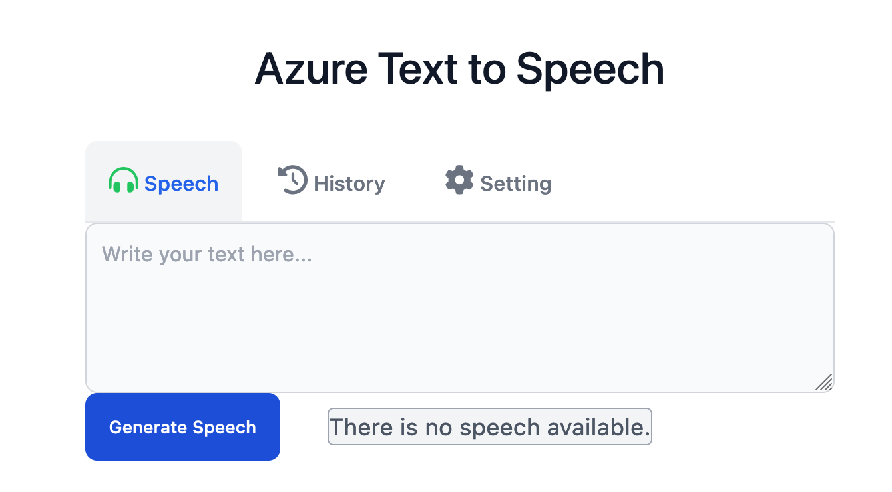

# Azure Text to Speech

A local Python server that converts text to speech using Azure Cognitive Services.

## Getting Started

Install the dependencies:

```sh
pip install -r requirements.txt
```

Configure the environment variables by creating a `.env` file:

```
SPEECH_KEY="YOUR_SPEECH_KEY"
SPEECH_REGION="YOUR_SPEECH_REGION
```

## Running the Server

```sh
python3 server.py
```



## Capabilities

- Convert text to speech
- Save speech to file (`~/.ttsfile`)
- Save history into database (`./database.db`)
- Clear history
